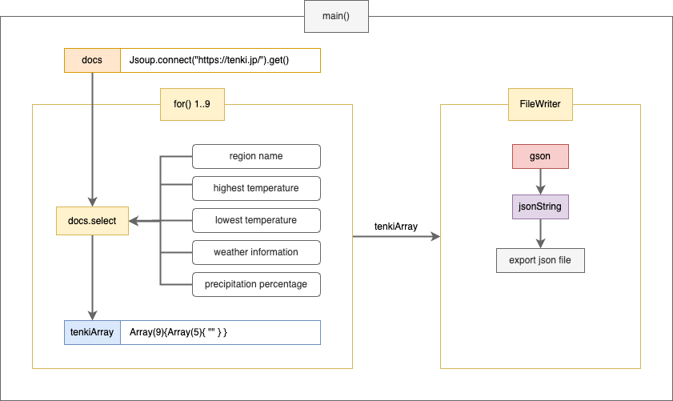

# Kotlin を使って天気情報スクレイピング
[TABIHOUDAI](https://github.com/chm209/tabihoudai)プロジェクトで使うために作りました。

# 構成図（アーキテクチャ）

#### コード構成図

##### [TABIHOUDAI](https://github.com/chm209/tabihoudai)との構成図（アーキテクチャ）

ーー

## 使っているもの：
1. Kotlin
2. Jsoup
3. Gson
4. jsonString
5. regex

** Dev/Tool
1. IntelliJ
2. Ubuntu Cron
3. VS Code