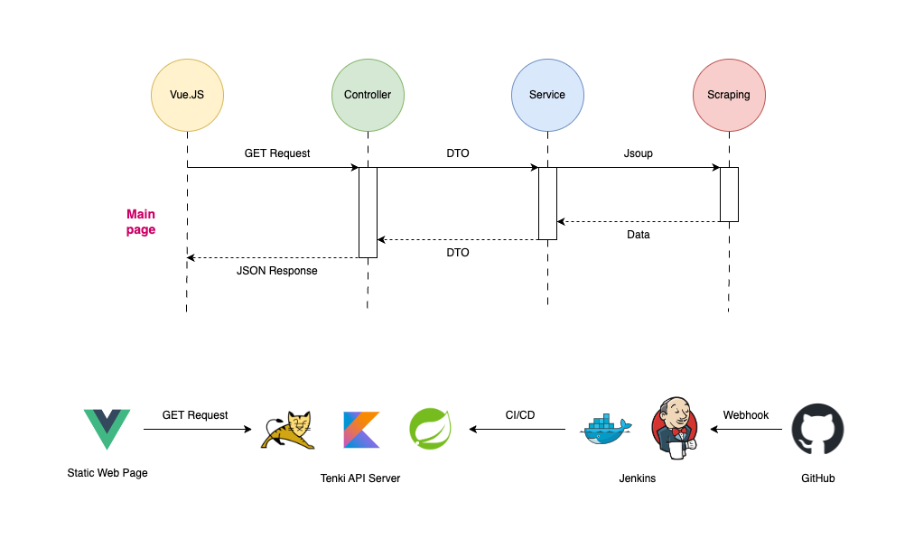

# Kotlin を使って天気情報スクレイピング
[TABIHOUDAI](https://github.com/chm209/tabihoudai)プロジェクトで使うために作りました。

# 構成図（アーキテクチャ）

ーー

## 使っているもの：
1. Kotlin
2. Jsoup
3. regex
4. Spring Boot

#### Dev/Tool
1. IntelliJ

#### Deploy
1. Ubuntu Server
2. Nginx
3. Docker
4. Jenkins